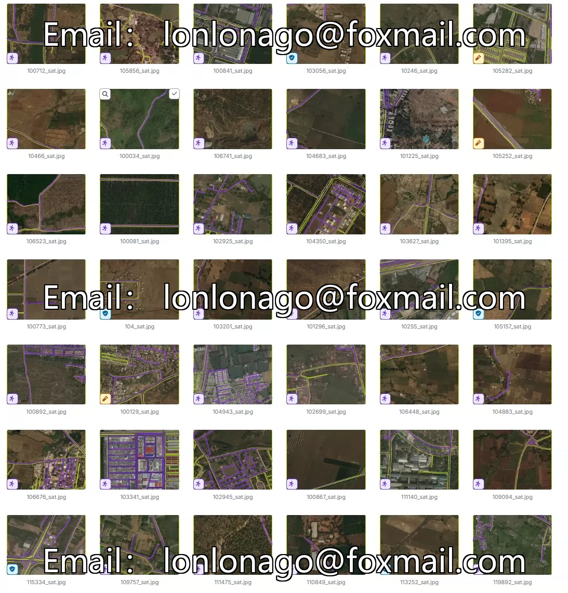
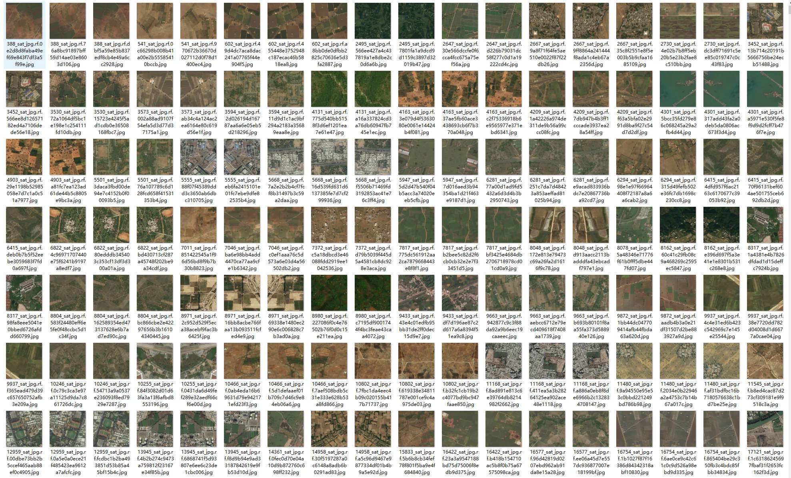
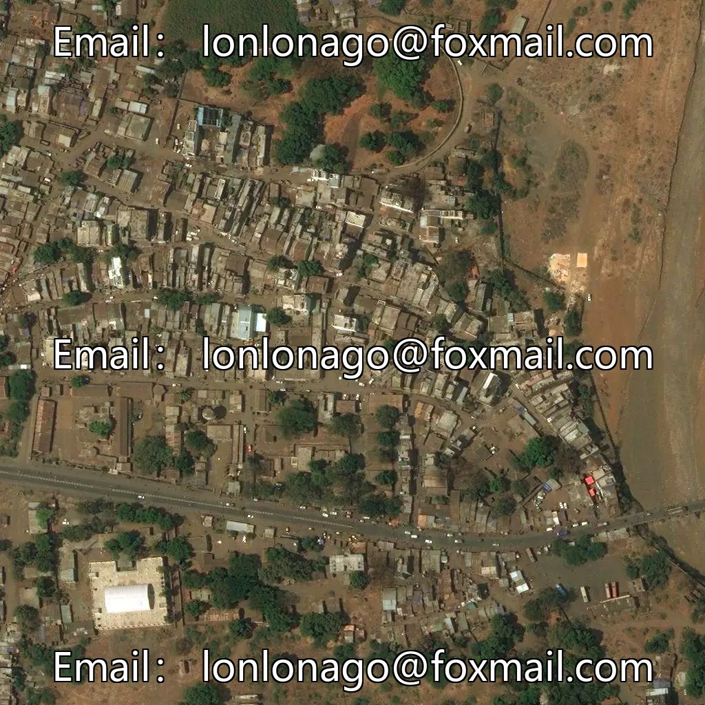
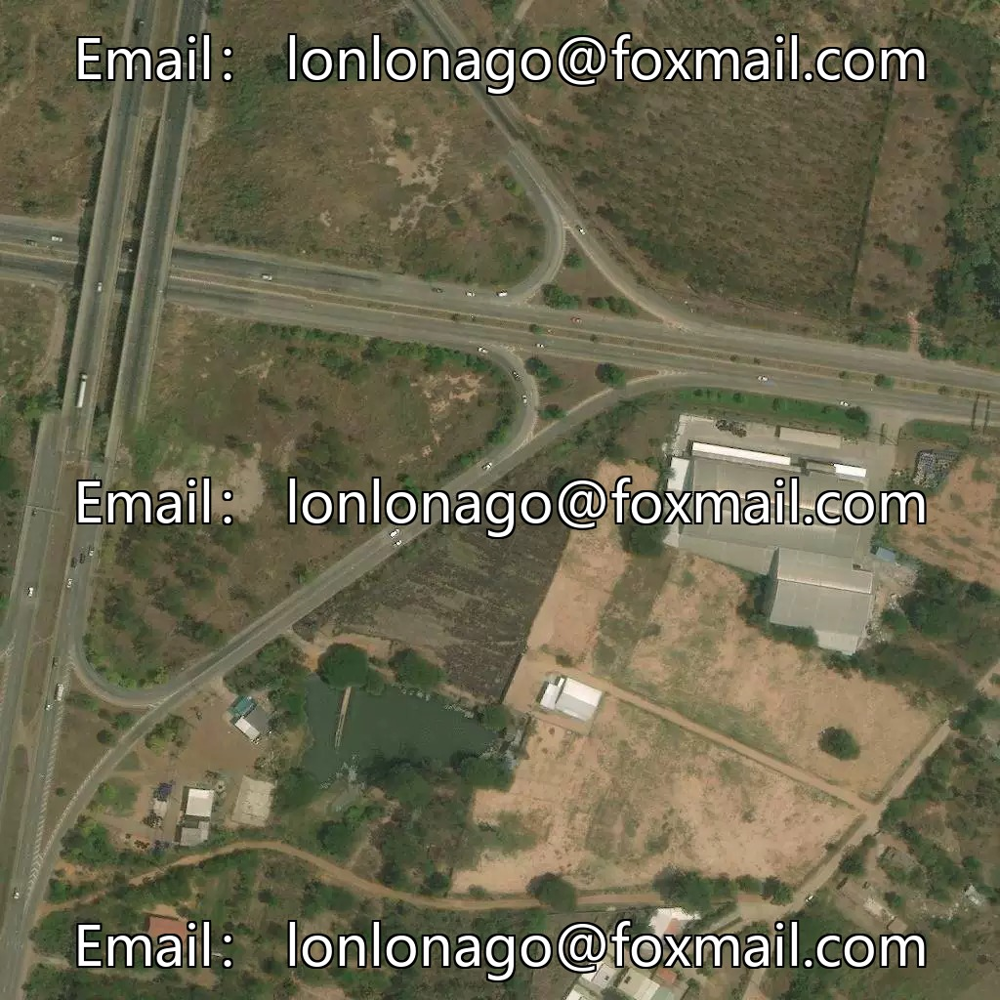
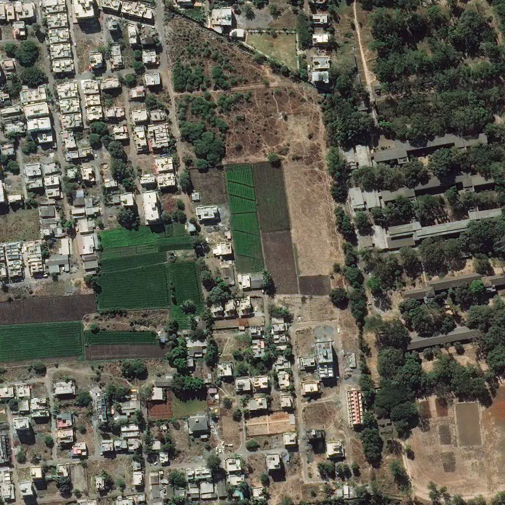
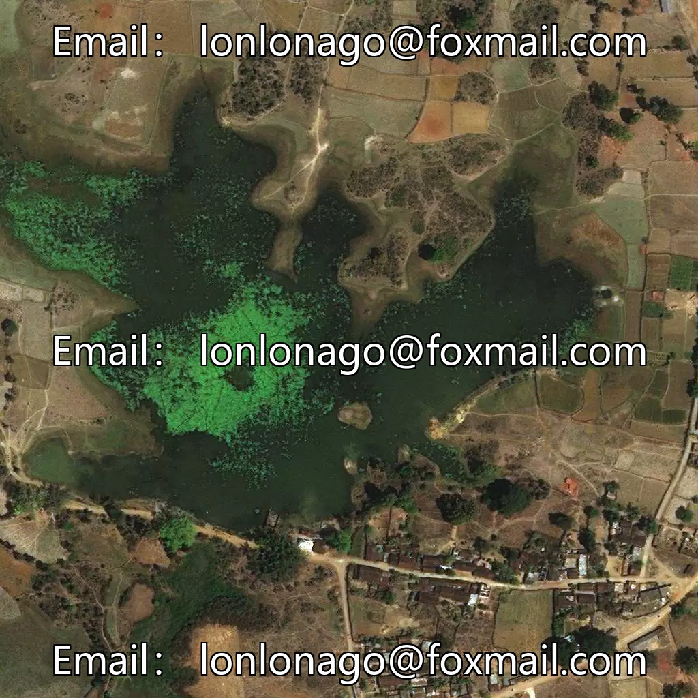
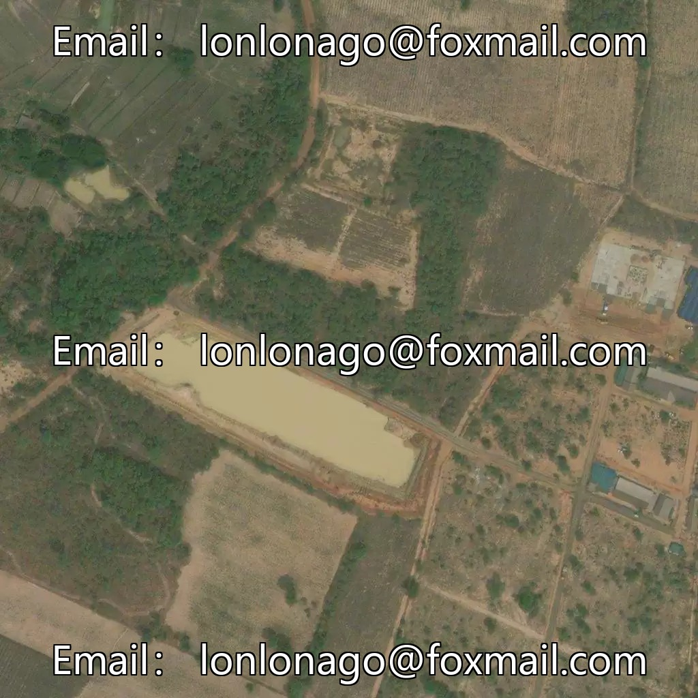

## Body

Remote Sensing Road Extraction Dataset in YOLO format

Totally 9382 images, each labeled in YOLO format. The training set (7923), test set (489), and validation set (970) are divided accordingly.

The dataset is divided into one category, namely "road" for roads.

Electronic virtual products sold without return or exchange.

## Images

item_1054724107697

Here is a pay link on Stripe ( https://buy.stripe.com/3cs8yP7sY87d0vu9AB ). Please contact me lonlonago@foxmail.com after funding $89, and I will send you a complete data files , thank you!

